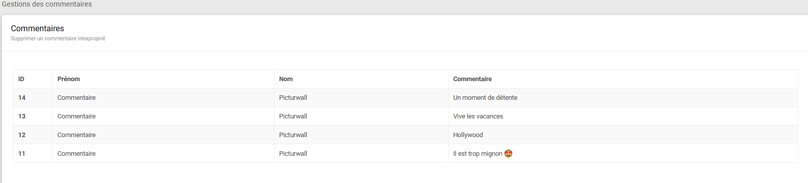
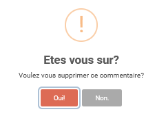

.. _animateur_gestion_commentaires:

Page gestion des commentaires
================================

La page de gestion des commentaires ressemble à ceci :

Cette page vous permet de gérer les commentaires déjà envoyés. C'est-à-dire que vous pourrez les supprimer après l'envoi grâce à cette page.

.. _animateur_gestion_commentaires_commentaire_supprimer:

Supprimer un commentaire envoyé
-----------------------------------

Afin de supprimer un commentaire qui a déjà été envoyé, il vous suffit de cliquer sur le commentaire en question.
Ensuite, vous allez voir cette fenêtre apparaître :

Pour refuser le commentaire, il suffit de cliquer sur "Oui !".

.. note:: La suppression d'un commentaire n'engendre pas la suppression du média associé.

.. important:: Une fois qu'un commentaire a été supprimé, vous ne pourrez pas le restaurer.
