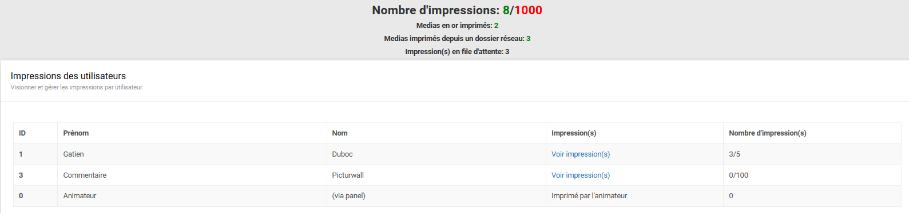
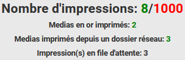
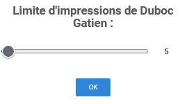
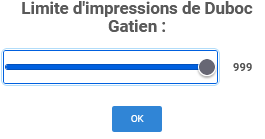
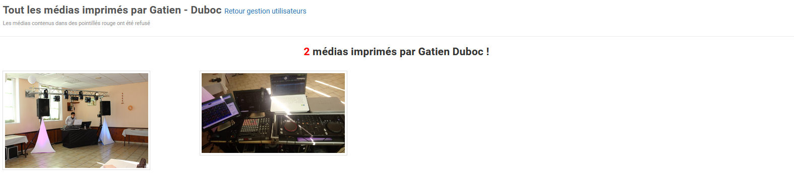
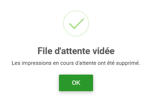

.. _animateur_gestion_impressions:

Page gestion des impressions
================================

La page de gestion des impressions ressemble à ceci :

Cette page vous permet de gérer les impressions par utilisateur. C'est-à-dire que c'est ici que vous pouvez définir le nombre d'impressions maximum de chaque utilisateur. Vous pouvez également visualiser le nombre d'impressions ici.

.. _animateur_gestion_impressions_compteur:

Compteur d'impressions
-------------------------------

Sur PicturWall, il existe plusieurs compteurs d'impressions. Ils ressemblent à cela :

* Première ligne : Nombre d'impressions au total / :ref:`Limite d'impressions totales <animateur_parametres_impression_max>`
* Seconde ligne : Nombre de médias en or imprimés
* Troisième ligne : Nombre d'impressions effectuées depuis un répertoire réseau (pour les photobooth fixe par exemple)
* Quatrième ligne : Nombre d'impressions sur la file d'attente de l'imprimante, avec un lien pour :ref:`Vider la file d'attente <animateur_gestion_impressions_file_vider>`

.. _animateur_gestion_impressions_limite:

Limite d'impressions par utilisateur
----------------------------------------

Afin d'augmenter la limite d'impression d'un utilisateur, il vous suffit de cliquer sur la case "Nombre d'impression(s)" de ce dernier.
Ensuite, vous allez voir cette fenêtre apparaître :

En déplaçant le curseur, vous allez pouvoir définir la limite d'impression pour l'utilisateur.

Valider le nombre d'impressions en cliquant sur "OK".

.. important:: Le nombre d'impressions par utilisateur global est à définir sur la page de paramètres, :ref:`section impression <animateur_parametres_section_impression>`.

Vous pouvez également mettre un nombre d'impressions illimité pour un utilisateur en définissant sa limite sur "999" :

.. note:: Si le nombre d'impressions est sous la forme : "impressions" au lieu de "impressions/limite d'impressions", c'est que l'utilisateur à un nombre d'impressions illimités

.. _animateur_gestion_impressions_utilisateur:

Voir impression d'un utilisateur
----------------------------------------

Afin de voir les impressions d'un utilisateur, il vous suffit de cliquer sur la case "Impression(s)" de ce dernier.
Ensuite, vous allez voir cette fenêtre apparaître :

Vous voyez désormais les photos imprimées par un utilisateur.

.. _animateur_gestion_impressions_file_vider:

Vider la file d'attente des impressions
--------------------------------------------

Vous pouvez vider manuellement la file d'attente des impressions en cas de problème ou nombre trop important.

En cliquant sur "(vider la file d'attente)" :

Cela va vider la file d'attente, puis redémarrer le service d'impression.