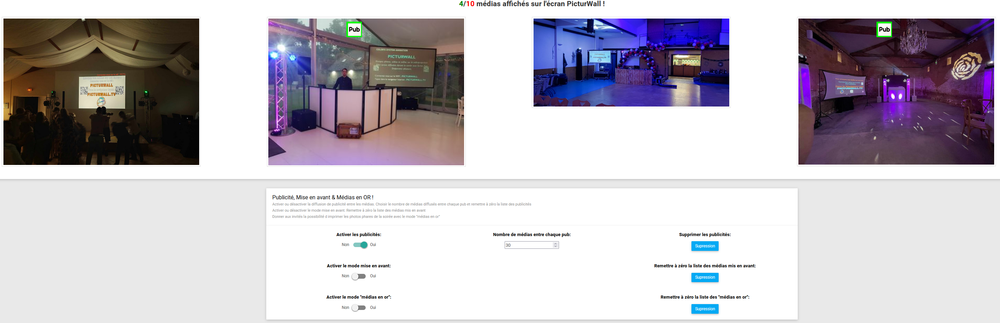
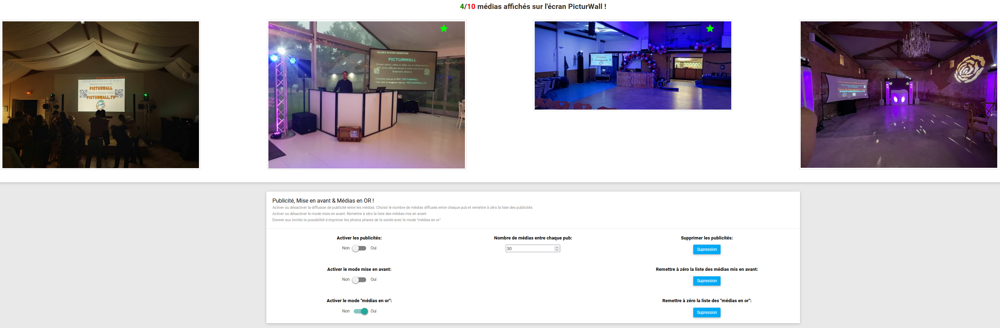
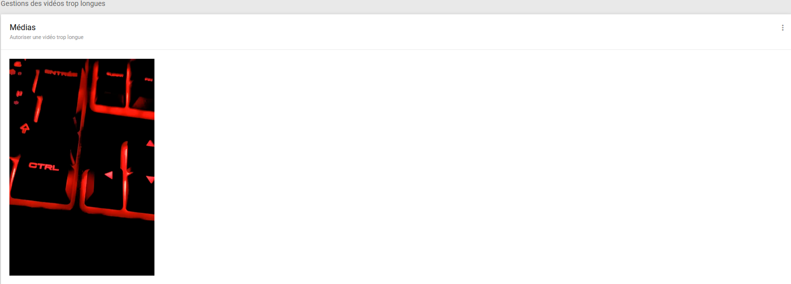
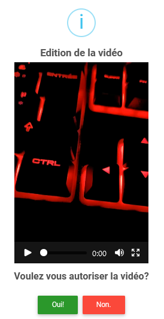

.. _animateur_gestion_medias:

Page gestion des médias
==========================

La page de gestion des médias ressemble à ceci :

Cette page vous permet de gérer les médias déjà envoyés. C'est-à-dire que vous pourrez les refuser, les tourner, les imprimer, les mettre en avant….

.. important:: Pour que les médias apparaissent ici, il faut qu'ils soient préalablement acceptés (de manière automatique ou manuelle).

.. _animateur_gestion_medias_media_refuser:

Refuser un média envoyé
---------------------------

Afin de refuser un média qui a déjà été envoyé, il vous suffit de cliquer sur la photo correspondante au média que vous voulez refuser.
Vous allez voir cette fenêtre apparaître :

.. figure:: _images/gestion_medias/gestion_medias_media.PNG
   :alt: Panel animateur de PicturWall, page gestion des médias, modification d'un média.
   :align: center

Pour refuser le média, il suffit de cliquer sur "Oui !" dans la partie "Voulez-vous refuser le média ?"

.. figure:: _images/gestion_medias/gestion_medias_media_refuser.PNG
   :alt: Panel animateur de PicturWall, page gestion des médias, modification d'un média, refuser le média.
   :align: center

.. important:: Vous pouvez retrouver les médias refusés sur la page ":ref:`Médias refusés <animateur_gestion_medias_recuperer_medias_refuses>`" accessible depuis la page de gestion des médias.

.. _animateur_gestion_medias_imprimer:

Imprimer un média
------------------------

Afin d'imprimer un média qui a déjà été envoyé, il vous suffit de cliquer sur la photo correspondante au média que vous voulez imprimer.
Vous allez voir cette fenêtre apparaître :

.. figure:: _images/gestion_medias/gestion_medias_media.PNG
   :alt: Panel animateur de PicturWall, page gestion des médias, imprimer un média.
   :align: center

Pour imprimer le média, il suffit de cliquer sur |bouton_imprimer| dans la partie "Impression du média".

.. |bouton_imprimer| image:: _images/gestion_medias/gestion_medias_media_imprimer.PNG
   :alt: Gestion des médias: Imprimer un média sur PicturWall.
   :scale: 75%

.. important:: Pour pouvoir imprimer, il faut qu'une imprimante soit configurée et active. Pour cela, veuillez vous rendre dans la :ref:`Section impression <animateur_parametres_section_impression>` des paramètres.

.. _animateur_gestion_medias_tourner:

Tourner un média
------------------------

Afin de tourner un média qui a déjà été envoyé, il vous suffit de cliquer sur la photo correspondante au média que vous voulez tourner.
Vous allez voir cette fenêtre apparaître :

.. figure:: _images/gestion_medias/gestion_medias_media.PNG
   :alt: Panel animateur de PicturWall, page gestion des médias, tourner un média.
   :align: center

Pour retourner verticalement le média, il suffit de cliquer sur |bouton_tourner_vertical| dans la partie "Rotation du média".

Pour tourner de 90° vers la gauche le média, il suffit de cliquer sur |bouton_tourner_gauche| dans la partie "Rotation du média".

Pour tourner de 90° vers la droite le média, il suffit de cliquer sur |bouton_tourner_droite| dans la partie "Rotation du média".

.. |bouton_tourner_vertical| image:: _images/gestion_medias/gestion_medias_media_rotation_verticale.PNG
   :alt: Gestion des médias: Tourner un média envoyé verticalement.
   :scale: 75%

.. |bouton_tourner_droite| image:: _images/gestion_medias/gestion_medias_media_rotation_droite.PNG
   :alt: Gestion des médias: Tourner un média envoyé vers la droite.
   :scale: 75%
.. warning:: Vous ne pouvez pas tourner une vidéo (par soucis de performance) !

.. _animateur_gestion_medias_publicite:

Médias publicitaire
----------------------------

Le mode publicité vous permet de sélectionner certains médias qui seront affichés à l'écran pour faire votre publicité ou pour promouvoir un produit.
Vous pouvez choisir le nombre de médias affichés entre chaque média publicité.
Pour cela, vous allez devoir sélectionner tous les "médias publicités". Ensuite il ne vous restera plus qu'à "activer les publicités".

Afin de sélectionner les "médias publicités", vous devez cliquer sur chaque média que vous voulez considérer comme publicité. Vous arriverez sur cette fenêtre :

.. figure:: _images/gestion_medias/gestion_medias_media.PNG
   :alt: Panel animateur de PicturWall, page gestion des médias, mettre en publicité un média.
   :align: center

Pour le tager comme étant un média publicitaire, il suffit de cliquer sur |bouton_publicite|.

.. |bouton_publicite| image:: _images/gestion_medias/gestion_medias_media_pub_activation.PNG
   :alt: Gestion des médias: Media publicitaire envoyé sur PicturWall.
   :scale: 75%

.. note:: Afin de supprimer le média de la liste, il suffit de cliquer sur |bouton_publicite_desactivation|.

Une fois ceci fait, vous allez vous retrouver avec une page qui ressemble à cela :

.. figure:: _images/gestion_medias/gestion_medias_pub_off.PNG
   :alt: Panel animateur de PicturWall, page gestion des médias, publicité : désactivé.
   :align: center

Vous remarquez que les médias sélectionnés possèdent un carré rouge "Pub". Cela signifie qu'ils sont bien des médias publicité sont sélectionnés, mais que le mode publicité est inactif.

Afin d'activer le mode publicité, vous allez devoir vous rendre sur le bas de la page de gestion des médias puis cliquer sur "Activer les publicités" dans la section "Publicité, Mise en avant & Médias en OR !":

.. figure:: _images/gestion_medias/gestion_medias_pub_avant_or.PNG
   :alt: Panel animateur de PicturWall, page gestion des médias, mode publicité.
   :align: center

.. admonition:: Supprimer les médias publicitaires :

   Pour supprimer rapidement les médias supplémentaires, il vous suffit de cliquer sur le bouton "Suppression" situé sous la ligne "Supprimer les publicités".

Une fois actif, le diaporama affichera une publicité tout les X médias. D'ailleurs, si le mode publicité est actif, les médias sélectionnés possèdent un rectangle vert "Pub" :

.. warning:: Pensez à désactiver le mode publicité lorsque qu'aucun média n'est dans la liste.

.. _animateur_gestion_medias_avant:

Médias en avant
------------------------

Le mode mise en avant vous permet de sélectionner certains médias qui seront affichés à l'écran. En effet, pendant un instant plus ou moins long, vous voulez peut-être pouvoir afficher seulement certains médias sur le vidéoprojecteur.
Pour cela, vous allez devoir sélectionner tous les médias que vous voulez mettre en avant. Ensuite il ne vous restera plus qu'à activer le mode "mise en avant".

Afin de sélectionner les médias à mettre en avant, vous devez cliquer sur chaque média que vous voulez mettre en avant. Vous arriverez sur cette fenêtre :

.. figure:: _images/gestion_medias/gestion_medias_media.PNG
   :alt: Panel animateur de PicturWall, page gestion des médias, mettre en avant un média.
   :align: center

Pour le mettre en avant, il suffit de cliquer sur |bouton_mise_avant|.

.. |bouton_mise_avant| image:: _images/gestion_medias/gestion_medias_media_mise_en_avant.PNG
   :alt: Gestion des médias: Mettre en avant un média envoyé sur PicturWall.
   :scale: 75%

.. note:: Afin de supprimer le média de la liste, il suffit de cliquer sur |bouton_diffusion_classique|.

.. |bouton_diffusion_classique| image:: _images/gestion_medias/gestion_medias_media_diffusion_classique.PNG
   :alt: Gestion des médias: Mettre en avant un média envoyé sur PicturWall, diffusion classique.
   :scale: 75%

Une fois ceci fait, vous allez vous retrouver avec une page qui ressemble à cela :

.. figure:: _images/gestion_medias/gestion_medias_avant_off.PNG
   :alt: Panel animateur de PicturWall, page gestion des médias, mise en avant : désactivé.
   :align: center

Vous remarquez que les médias sélectionnés sont encadrés en rouge. Cela signifie qu'ils sont bien des médias sélectionnés pour être mis en avant, mais que le mode mise en avant est inactif.

Afin d'activer le mode mise en avant, vous allez devoir vous rendre sur le bas de la page de gestion des médias puis cliquer sur "Activer le mode mise en avant" dans la section "Publicité, Mise en avant & Médias en OR !":

.. figure:: _images/gestion_medias/gestion_medias_pub_avant_or.PNG
   :alt: Panel animateur de PicturWall, page gestion des médias, mise en avant.
   :align: center

.. admonition:: Remettre à zéro la liste des médias mis en avant :

   Pour remettre rapidement à 0 la liste des médias mis en avant, il vous suffit de cliquer sur le bouton "Suppression" situé sous la ligne "Remettre à zéro la liste des médias mis en avant".

Une fois actif, le diaporama affichera uniquement les médias sélectionnés. D'ailleurs, si le mode de mise en avant est actif, les médias sélectionnés seront encadrés en vert :

.. figure:: _images/gestion_medias/gestion_medias_avant_on.PNG
   :alt: Panel animateur de PicturWall, page gestion des médias, mise en avant.
   :align: center

.. warning:: Pensez à désactiver le mode mise en avant lorsque qu'aucun média n'est dans la liste. Sinon, PicturWall n'affichera plus de média !

.. _animateur_gestion_medias_or:

Médias en or
--------------------

Comme expliqué dans la partie :ref:`Imprimer après coup <invite_impression_apres_coup>` du panel invité, les "médias en or" sont une liste de médias accessibles à chaque invité pour qu'ils puissent les imprimer.

Vous pouvez par exemple mettre les plus belles photos de familles dans cette partie afin que chaque invité puisse l'imprimer depuis sa page invitée.

Afin de sélectionner les médias en or, vous devez cliquer sur chaque média que vous voulez sélectionner comme média en or. Vous arriverez sur cette fenêtre :

.. figure:: _images/gestion_medias/gestion_medias_media.PNG
   :alt: Panel animateur de PicturWall, page gestion des médias, média en or.
   :align: center

Pour le mettre en avant, il suffit de cliquer sur |bouton_media_or|.

.. warning:: Vous ne pouvez pas tager une vidéo comme "média en or". Ce qui est logique, puisque que vous ne pourrez pas l'imprimer.

.. note:: Afin de supprimer le média de la liste, il suffit de recliquer sur le bouton |bouton_media_or|.

.. |bouton_media_or| image:: _images/gestion_medias/gestion_medias_media_media_en_or.PNG
   :alt: Gestion des médias: Mettre en or un média envoyé sur PicturWall.
   :scale: 75%

Une fois ceci fait, vous allez vous retrouver avec une page qui ressemble à cela :

Vous remarquez que les médias sélectionnés possèdent une étoile rouge. Cela signifie qu'ils sont bien des médias sélectionnés pour être des médias en or, mais que le mode "média en or" est inactif.

Afin d'activer le mode "média en or", vous allez devoir vous rendre sur le bas de la page de gestion des médias puis cliquer sur 'Activer le mode "médias en or"' dans la section "Publicité, Mise en avant & Médias en OR !" :

.. figure:: _images/gestion_medias/gestion_medias_pub_avant_or.PNG
   :alt: Panel animateur de PicturWall, page gestion des médias, médias en or.
   :align: center

.. admonition:: Remettre à zéro la liste des médias en or :

   Pour remettre rapidement à 0 la liste des médias en or, il vous suffit de cliquer sur le bouton "Suppression" situé sous la ligne "Remettre à zéro la liste des 'médias en or'".

Une fois actif, les invités pourront imprimer les médias sélectionnés (section :ref:`Impression après coup <invite_impression_apres_coup>`). D'ailleurs, si le mode "médias en or" est actif, les médias sélectionnés posséderont une étoile verte :

.. warning:: Pour pouvoir mettre le mode "médias en or", il faut qu'une imprimante soit configurée et active. Pour cela, veuillez vous rendre dans la :ref:`section impression <animateur_parametres_section_impression>` des paramètres.

.. _animateur_gestion_medias_recuperer_medias_refuses:

Récupérer les médias refusés
---------------------------------

Les médias refusés ne sont pas perdus.

Vous pouvez les retrouver en cliquant sur les trois petits points en haut à droite de la page "gestion des médias". Voici où il se trouve :

.. figure:: _images/gestion_medias/gestion_medias_page.PNG
   :alt: Panel animateur de PicturWall, page gestion des médias, Pages supplémentaires
   :align: center

Une fois que vous avez cliqué sur les trois points verticaux, vous pouvez sélectionner "Médias refusés" :

.. figure:: _images/gestion_medias/gestion_medias_page_supp.PNG
   :alt: Panel animateur de PicturWall, page gestion des médias, Pages supplémentaires
   :align: center

Vous allez donc atterrir sur la page des médias refusés, qui ressemblera à cela :

.. figure:: _images/gestion_medias/gestion_medias_page_refuse.PNG
   :alt: Panel animateur de PicturWall, page gestion des médias refusés
   :align: center

Comme pour la page gestion des médias, vous aurez qu'à sélectionner un média puis cliquer sur "Oui !" pour le restaurer.

.. figure:: _images/gestion_medias/gestion_medias_page_refuse_media.PNG
   :alt: Panel animateur de PicturWall, page gestion des médias refusés. Restaurer un média3
   :align: center

.. note:: Si vous voulez interagir avec le média restauré, pensez à vous rendre sur la page "Gestion des médias".

.. _animateur_gestion_medias_new:

Voir rapidement les nouveaux médias
-----------------------------------------

Il existe une façon de vérifier rapidement les nouveaux médias qui ont été envoyés sur PicturWall. Il existe une page qui vous montre les nouveaux médias envoyés depuis son dernier chargement.

C'est-à-dire qu'il vous suffit de recharger la page quand vous avez une minute à perdre afin de voir uniquement les nouveaux médias.

Vous pouvez retrouver cette page en cliquant sur les trois petits points en haut à droite de la page "gestion des médias". Voici où il se trouve :

.. figure:: _images/gestion_medias/gestion_medias_page.PNG
   :alt: Panel animateur de PicturWall, page gestion des médias, Pages supplémentaires
   :align: center

Une fois que vous avez cliqué sur les trois points verticaux, vous pouvez sélectionner "Nouveaux médias" :

.. figure:: _images/gestion_medias/gestion_medias_page_supp.PNG
   :alt: Panel animateur de PicturWall, page gestion des médias, Pages supplémentaires
   :align: center

Vous allez donc atterrir sur la page des nouveaux médias, qui ressemblera à cela :

.. figure:: _images/gestion_medias/gestion_medias_page_nouveau.PNG
   :alt: Panel animateur de PicturWall, page des nouveaux médias
   :align: center

Comme pour la page gestion des médias, vous pourrez interagir avec un média en cliquant dessus.

.. note:: N'oubliez pas de recharger la page pour voir les nouveaux médias. Il n'y a pas de rechargement automatique sur la page des nouveaux médias.

.. _animateur_gestion_medias_long:

Vidéo trop longues
--------------------------

Les vidéos qui ont été envoyées sur PicturWall et qui dépassent le temps maximum des vidéos lues se retrouvent toutes sur une page accessible depuis la gestion des médias.

Sur cette page, vous pourrez forcer la prise en compte d'une vidéo trop longue.

Vous pouvez retrouver cette page en cliquant sur les trois petits points en haut à droite de la page "gestion des médias". Voici où il se trouve :

.. figure:: _images/gestion_medias/gestion_medias_page.PNG
   :alt: Panel animateur de PicturWall, page gestion des médias, Pages supplémentaires
   :align: center

Une fois que vous avez cliqué sur les trois points verticaux, vous pouvez sélectionner "Vidéos trop longues" :

.. figure:: _images/gestion_medias/gestion_medias_page_supp.PNG
   :alt: Panel animateur de PicturWall, page gestion des médias, Pages supplémentaires
   :align: center

Vous allez donc atterrir sur la page des vidéos trop longues, qui ressemblera à cela :

Comme pour la page gestion des médias, vous aurez qu'à sélectionner un média puis cliquer sur "Oui !" pour le restaurer.

.. note:: La :ref:`durée maximale des vidéos lues <animateur_parametres_videos_duree_maximale>` est définie sur la page paramètre de PicturWall, :ref:`section vidéo <animateur_parametres_videos_duree_maximale>` .
