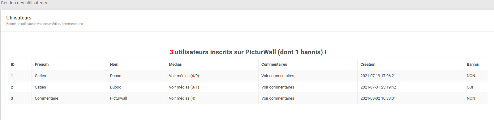
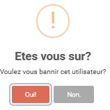
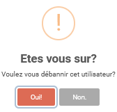
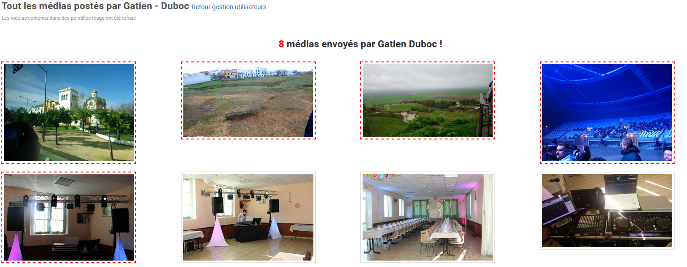
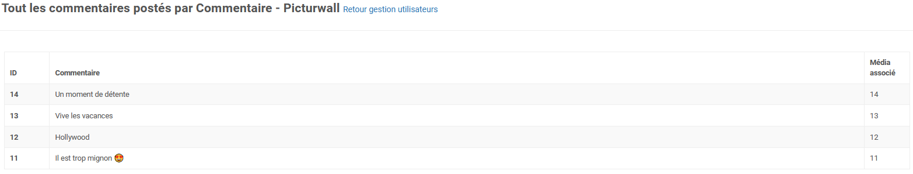

.. _animateur_gestion_utilisateurs:

Page gestion des utilisateurs
================================

La page de gestion des utilisateurs ressemble à ceci :

Cette page vous permet de gérer les utilisateurs de PicturWall. C'est à dire que vous pourrez bannir et "débannir" les utilisateurs.

.. _animateur_gestion_utilisateurs_bannir:

Bannir un utilisateur
-------------------------------

Afin de bannir un utilisateur, il vous suffit de cliquer sur la case "Bannis" en question.
Ensuite, vous allez voir cette fenêtre apparaître :

Pour bannir l'utilisateur, il suffit de cliquer sur "Oui!".

.. note:: Les médias d'un utilisateurs bannis ne passeront plus sur le diaporama. Néanmoins, vous pouvez :ref:` récupérer tous ses médias <animateur_sauvegarde>`.

.. _animateur_gestion_utilisateurs_debannir:

Debannir un utilisateur
-------------------------------

Afin de "débannir" (CF. Pardonner) un utilisateur, il vous suffit de cliquer sur la case "Bannis" en question.
Ensuite, vous allez voir cette fenêtre apparaître :

Pour debannir l'utilisateur, il suffit de cliquer sur "Oui!".

.. note:: Les médias d'un utilisateurs bannis seront restaurés. C'est à dire qu'ils pourront repasser sur le diaporama.

.. _animateur_gestion_utilisateurs_user:

Voir les médias d'un invité
-------------------------------

Pour visualiser les médias d'un seul invité, il faut que vous cliquiez sur la colonne "Voir médias (médias acceptés / médias envoyés)" de l'utilisateur souhaité.
Ensuite, vous allez voir cette fenêtre apparaître :

Vous avez maintenant accès à ses médias.

.. note:: Les médias encadrés en rouge sont refusés.

.. _animateur_gestion_utilisateurs_commentaire:

Voir les commentaires d'un invité
--------------------------------------

Pour visualiser les commentaires d'un seul invité, il faut que vous cliquiez sur la colonne "Voir commentaires" de l'utilisateur souhaité.
Ensuite, vous allez voir cette fenêtre apparaître :

Vous avez maintenant accès à ses commentaires.

.. note:: Vous ne pouvez pas administrer des commentaires depuis cette page.