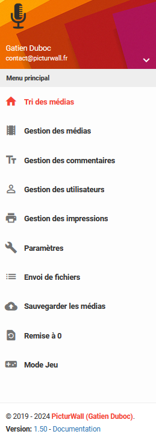
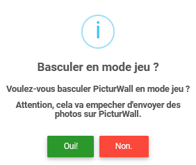

.. _animateur_jeu:

Mode jeu
===================

PicturWall possède des mini-jeux !
Vous allez pouvoir y découvrir un mode Quizz, un mode QCM et bientôt d'autres mini-jeux !

.. important:: La documentation des mini-jeux est sur le lien suivant : `Documentation mini jeux <https://docs.jeu.picturwall.fr>`_

.. _animateur_jeu_bascule:

Basculer en mode jeu
---------------------------------------------

Afin de basculer en "mode jeu", vous devez cliquer sur le texte "Mode Jeu"

Ensuite, vous allez voir cette fenêtre apparaître :

Il vous suffit de cliquer sur "Oui !" pour basculer en mode mini-jeux.

.. important:: Le panel de PicturWall va automatiquement basculer sur l'interface d'administration des jeux (10 secondes après la bascule).

.. note:: Si vous n'êtes pas connecté au wifi de PicturWall, remplacez l'URL par : http://192.168.200.254/admin