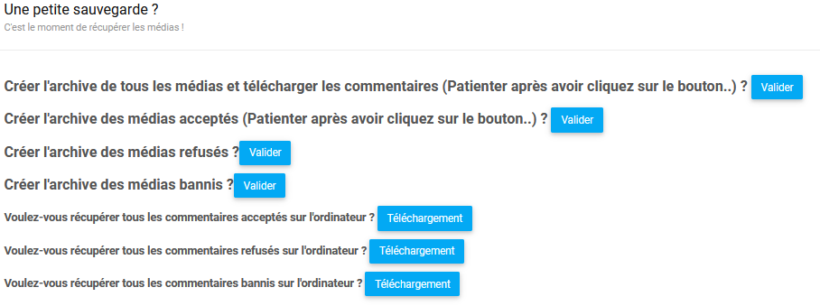
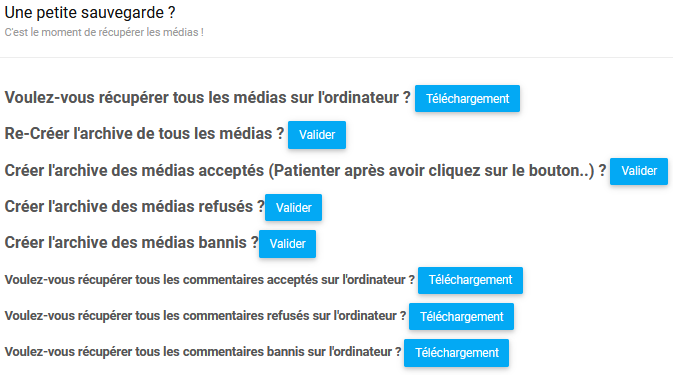

.. _animateur_sauvegarde:

Page sauvegarder les médias
================================

La page de sauvegarde des utilisateurs ressemble à ceci:

Cette page vous permet de sauvegarder l'ensemble des médias (et commentaires) de PicturWall.

Vous pouvez télécharger :
* Tous les médias et commentaires
* Les médias acceptés
* Les médias refusés
* Les médias de personne bannis
* Tous les commentaires
* Les commentaires acceptés
* Les commentaires refusés
* Les commentaire de personne bannis

Nous allons faire l'exemple pour un seul cas, celui pour tout récupérer.
La méthode reste identique pour les autres récupérations.

.. _animateur_sauvegarde_medias:

Sauvegarder tous les médias et commentaires
---------------------------------------------

Afin de sauvegarder tous les médias, vous allez cliquer sur le bouton "Valider" de la ligne "Créer l'archive de tous les médias [...].
Ensuite, vous allez voir cette fenêtre apparraître :

Afin de créer l'archive, il suffit de cliquer sur "Oui!".

.. important:: Une fois ceci fait, il faut patienter jusqu'à l'apparition de la ligne "Voulez-vous récupérer tous les médias sur l'ordinateur ?".

Afin de récupérer l'archive contenant tous les médias, il suffit de cliquer sur "Oui!".

Vous pouvez désormais cliquer sur le bouton "Téléchargement" de la ligne "Voulez-vous récupérer tous les médias sur l'ordinateur ?"..
Vous allez voir apparaître cette fenêtre :

Afin de télécharger l'archive, il suffit de cliquer sur "Oui!".

