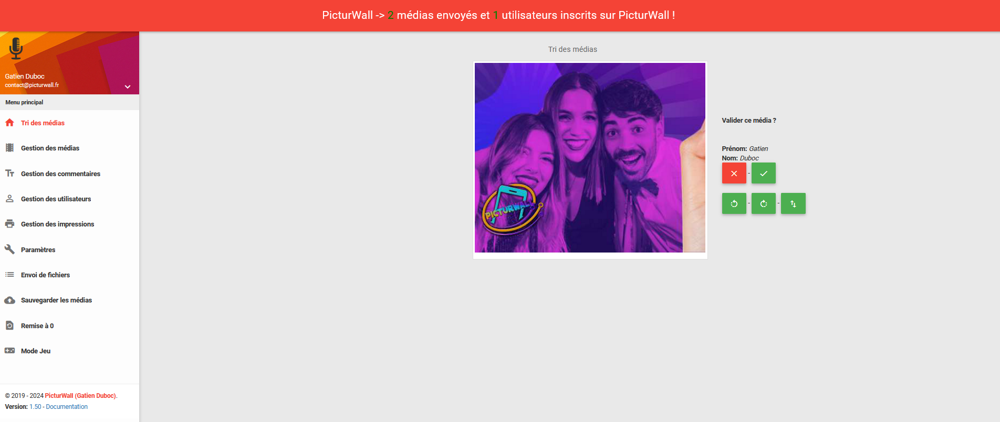
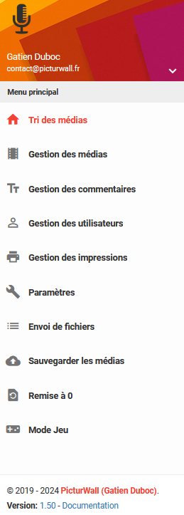

.. _panel-animateur:

Présentation du panel animateur
=================================

Le panel animateur sert à contrôler l'ensemble de PicturWall.
Des médias envoyés aux paramètres de personnalisation du diaporama, tout en passant par le nombre maximum d'impressions par personne...
Il est très complet et relativement facile d'utilisation une fois prit en main.

Dans la suite de ces pages, je vais utiliser le pronom "vous". Cela désigne l'animateur ou toute personne ayant un accès au panel animateur de PicturWall.
Pour le moment, nous recommandons l'utilisation d'un ordinateur avec un écran de taille standard afin d'utiliser le panel.

Le panel animateur ressemble à ceci :

Vous pouvez accéder aux différentes pages de gestion en cliquant sur le menu:

Voici les points que nous allons détailler lors de cette documentation :

.. toctree::
    :maxdepth: 2
    :caption: Panel animateur :

    animateur_tri_medias
    animateur_gestion_medias
    animateur_gestion_commentaires
    animateur_gestion_utilisateurs
    animateur_gestion_impressions
    animateur_parametres
    animateur_envoi_fichiers
    animateur_sauvegarde
    animateur_reset
    animateur_jeu
    animateur_overlays_affichage
    animateur_overlays_edition
    animateur_changelogs
    animateur_debug

Se rendre sur le panel animateur ?
=======================================

Afin de se connecter au panel animateur, vous devrez être préalablement connecté au réseau wifi public de PicturWall.
Ensuite, vous allez ouvrir votre navigateur préféré, puis tapez l'adresse URL suivante : `picturwall.tv/panel <http://picturwall.tv/panel/>`_

Vous arriverez sur une page d'authentification que voici :

.. figure:: _images/login.PNG
   :alt: Connexion au panel animateur de PicturWall.
   :align: center

.. admonition:: Identification

    Les identifiants que vous devez utiliser pour vous connecter sont ceux que vous avez renseigné lors de l'achat de PicturWall.
