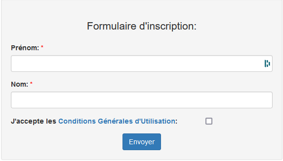
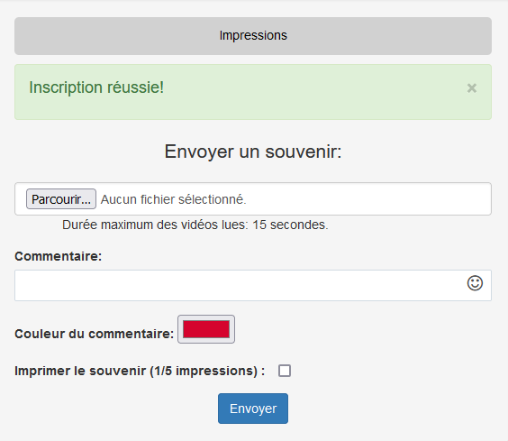

.. _panel-invite:

Présentation du panel invité
===============================

Le panel invité, c'est la page que les convives de la soirée vont utiliser pour mettre en ligne leurs médias.
Elle est très facile d'utilisation.

Dans la suite de cette page, je vais utiliser le pronom "vous". Cela désigne toute personne voulant envoyer un média sur PicturWall. Ce n'est pas uniquement réservé à l'animateur.

Comment se rendre sur le panel invité ?
========================================

Afin de ce connecter au panel invité, vous devrez être préalablement connecté au réseau wifi public de PicturWall.
Ensuite, vous allez ouvrir votre navigateur préféré, puis tapez l'adresse URL suivante: picturwall.tv_

Bien-sûr, c'est exactement la même chose sur téléphone. 
Vous ouvrez votre navigateur et tapez picturwall.tv_ dans votre barre de recherche.

Inscription
------------

Pour s'incrire sur le panel invité, vous devez simplement remplir votre nom et prénom.
Ensuite, vous acceptez les conditions d'utilisations, et vous cliquez sur |bouton_envoyer|.

.. _invite_media:

Envoyer un média
===================
L'envoi de média sur PicturWall est très simple:

* Sélectionner son média dans votre galerie photo, ou de prendre la photo en direct !
* Écrire un :ref:`Commentaire <invite_media_commentaire>` (facultatif) ;)
* Cocher (ou non) la case pour :ref:`"imprimer le souvenir" <invite_media_imprimer>` !

.. _invite_media_commentaire:

Commentaire
------------

.. figure:: _images/invite_medias_commentaire.PNG
   :alt: Ajouter un commentaire sur l'envoi de son image.
   :align: center

Avec PicturWall, vous avez la possibilité d'ajouter un commentaire avec l'envoi de votre souvenir.
Celui-ci s'affichera sur le diaporama (ajouter lien), en haut de l'écran.

Le commentaire doit être composé d'au moins 5 caractères. 

De plus, vous pouvez y ajouter un smiley, via l'icone associé à droite de la barre de commentaire |bouton_smiley|.

Pour finir, vous pouvez personnaliser la couleur du commentaire envoyé grâce au sélecteur de couleur |bouton_commentaire_couleur|.

.. admonition:: Personnalisation

    Vous pouvez changer la couleur par défaut des commentaires via un paramètre du panel animateur (ajouter lien).

.. _invite_media_imprimer:

Imprimer le souvenir
---------------------

.. important:: Pour que cette case soit visible, il faut activer le service d'impression (ajouter lien).

Grâce à PicturWall, les invités peuvent eux-mêmes imprimer leur souvenir !

Bien sûr, tout est prévu sur le panel animateur (ajouter lien) pour que vous puissiez définir des limites d'impressions par utilisateurs, impresssions maximales... (ajouter lien).

.. admonition:: Autoriser les invités à imprimer

    Pour que cette case soit active, il faut autoriser les invités à imprimer (ajouter lien).

.. _invite_impression_apres_coup:

Imprimer après coup
=====================

Vous pouvez aussi vouloir imprimer un média après coup !

Pour cela, vous devez cliquer sur ce bouton: |bouton_impression|

Vous allez donc atterrir sur cette page:

Ensuite, il ne vous restera plus qu'à cliquer sur le média que vous voulez imprimer:

.. figure:: _images/invite_impressions_imprimer_medias.PNG
   :alt: Imprimer un souvenir après coup, lancer l'impression.
   :align: center

Et vous pouvez vous rendre jusqu'à l'imprimante pour récupérer votre média ;)

.. admonition:: Autoriser les invités à imprimer après coup

    Pour que les invités puissent accéder à cette page, il faut autoriser l'impression après coup (ajouter lien).

Afin de revenir à la page d'envoi de médias, il faut cliquer sur ce bouton: |bouton_impression_envoyer_souvenir|

Média en or
-------------

Sur PicturWall, il existe un concept que l'on nomme "**média en or**".

C'est en réalité un ou plusieurs médias que l'animateur met à disposition de tous pour l'impression. Nous détaillons cette fonction dans le panel animateur, page "Édition de médias" (ajouter lien).

Les invités voient les médias mis à disposition de cette façon:

Vous pouvez imprimer ce type de média comme tous les autres.

.. admonition:: Médias en or

    Les médias en or sont tous sélectionnés par l'animateur. Par exemple, cela peut-être des photos d'autres invités ou du photographe.

.. |bouton_envoyer| image:: _images/invite_bouton_envoyer.PNG
    :alt: Bouton envoyer.

.. |bouton_smiley| image:: _images/invite_bouton_smiley.PNG
    :alt: Ajouter un smiley au commentaire.

.. |bouton_commentaire_couleur| image:: _images/invite_bouton_commentaire_couleur.PNG
    :alt: Ajouter une couleur au commentaire.
    :scale: 75%

.. |bouton_impression| image:: _images/invite_bouton_impression.PNG
    :alt: Bouton pour accéder aux impressions après coup.
    :scale: 75%

.. _picturwall.tv: http://picturwall.tv/

